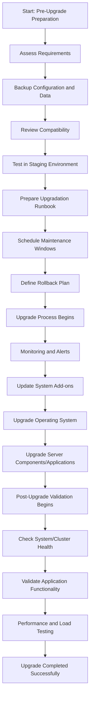

- [System Administration](#System-Administration)
  - [Linux Architecture]()
  - [Difference between Linux & Windows](#Difference-Between-Linux-and-Windows)
  - [A concise explanation of Process, Thread, Daemon, and Service](#process-thread-daemon-service)
  - [Hardware/Resource Sizing Planning(BOQ)](#Hardware-Sizing-Planning-for-Application)
  - [To Upgrade a Live Production System - Key Considerations](#to-upgrade-a-live-production-system---key-considerations)
  - Asymmetric key & Symmetric key
  - 
  - 
  - 
  - 

- [Database](#Database)
  - [Point-in-time recovery(PITR)](#)

## System Administration🚀
 

## 💡🌐[Difference between Linux and Windows]()

| **Key Diff**               | **Linux OS**                                                                                     | **Windows**                                                |
|----------------------------|--------------------------------------------------------------------------------------------------|------------------------------------------------------------|
| **Licensing**              | Open Source                                                                                      | Closed Source                                              |
| **Customizable**           | Can modify & redistribute                                                                        | Can’t modify & redistribute                                |
| **User Comfort**           | Less user-friendly                                                                               | Almost user-friendly                                       |
| **Kernel Type**            | Monolithic                                                                                       | Hybrid                                                     |
| **Manufacturer**           | Developed by the community (overseen by Linus Torvalds)                                          | Microsoft                                                  |
| **File System**            | ext2, ext3, ext4, NTFS, FAT, XFS                                                                 | NTFS, FAT                                                  |
| **Programm**               | C                                                                                                | Assembly, C, C++                                           |
| **Boot Time**              | Faster (drivers loaded dynamically)                                                              | Slower (all drivers loaded at boot)                        |
| **Security**               | High                                                                                             | Lower compared to Linux                                    |
| **License**                | GNU Public License                                                                               | Proprietary                                                |
| **Preceded by**            | Basic Terminal (CLI)                                                                             | MS-DOS                                                     |
| **Usage**                  | Installable on a wide range of hardware (phones, tablets, consoles, mainframes, supercomputers)  | Mainly on PCs, desktops, laptops, servers                  |
| **OS Family**              | GNU                                                                                              | DOS                                                        |

 

## 💡🌐[Process-Thread-Daemon-Service]()

Here's a concise explanation of `processes`, `threads`, `daemons`, and `services` in Linux, along with examples and their relationships:

### 📌[Process]()

- A process is an instance of a running program. It is the basic unit of execution in Linux.\
- Each process has its own memory space, and it can perform tasks independently.\
- A process can creates other processes which are known as Child Processes.

🔄**Example:** Running firefox creates a process for the Firefox web browser. When you run **`ls -la`**, it creates a temporary process that executes the command and produces output. 

⏰**Relation to threads & daemon:**\
**`A process can create multiple threads to perform tasks concurrently. A daemon is a type of process that runs in the background.`**

------------------------------------------------------------------------------------------------------------------------------

### 📌[Thread]()                                                                                                     

- A thread is the smallest unit of a process that can be scheduled by the operating system.\
- Threads share the same memory space and resources of the parent process but run independently.\
- A thread have 3 states: running, ready, and blocked

🔄**Example:** In a web server like Apache, each request might be handled by a separate thread within the same process.

⏰**Relation to process:**\
**`Threads exist within a process and share its resources. Multiple threads can run simultaneously within the same process.`**

------------------------------------------------------------------------------------------------------------------------------

### 📌[Daemon]()

- A daemon is a background process that runs continuously and is usually started at boot time.
- Daemons typically provide system or network services.

🔄**Example:** **`cron`** is a daemon that executes scheduled tasks & **`httpd`** handles incoming HTTP requests and serves web pages.

⏰**Relation to process:**\
**`A daemon is a type of process, but it runs in the background and is detached from any terminal session.`**

------------------------------------------------------------------------------------------------------------------------------

### 📌[Service]()

- A service is a specific function or set of functions provided by the operating system, usually managed by a daemon.
- Services are typically started at boot and managed by service managers like systemd.

🔄**Example:** `nginx` as a web server service that is managed by the `nginx` daemon.

⏰**Relation to daemon:**\
**`A service is provided by a daemon process. Services can involve multiple processes and threads to perform their tasks.`**

### 📌[Relationships]()

- A process is an independent program, while threads are the sub-units of a process, sharing its resources.
- All daemons are processes, but not all processes are daemons. Daemons run in the background and provide services.
- A service is typically provided by a daemon. The daemon manages the process(es) that provide the service.

------------------------------------------------------------------------------------------------------------------------------

## 💡🌐[Hardware Sizing Planning for Application](#Hardware-Sizing-Planning-for-Application)

### Definitions:

- **Operating System**: The software that manages hardware resources and provides services for application software.

- **Application**: The software application being deployed or planned, which performs specific tasks or functions.

- **Total Active User**: The total number of users actively interacting with the application at any given time.

- **TPS (Transactions Per Second)**: The number of transactions processed by the application per second.

- **Concurrent Login**: The number of users logged into the application simultaneously.

- **Concurrent User**: A user who is active in a collaborative editing session. Idle users connected to the document do not significantly impact the server load.

- **Concurrent Session**: The number of active sessions at the same time. For collaborative applications, it indicates how many users are actively engaged in the application simultaneously.

### Example Scenario:

- **Concurrent Sessions Requirement**: 500

- **Current Capacity Handling**: In a NodeJS setup, 514 concurrent sessions are handled by a server with 4 Core CPUs and 8 GB of RAM.

- **Resource Requirement**: Based on the above scenario, the application needs 2 NL/MW (Network Layer/Middleware) servers, each with at least 4 Core CPUs and 8 GB of RAM.

- **High Availability**: To ensure high availability and avoid a single point of failure, deploy two of each critical component:
  - Load Balancer (LB)
  - Web Server
  - NL/MW (Network Layer/Middleware)
  - BL/MW (Business Logic/Middleware)

### Recommendations for Hardware Sizing:

- **Scalability**: Ensure that the hardware configuration allows for scaling up (increasing resources on existing machines) and scaling out (adding more machines) to accommodate growth.

- **Monitoring**: Implement monitoring tools to track server performance and application load. This helps in making informed decisions about resource adjustments.

- **Testing**: Conduct load testing and performance benchmarking to validate the hardware sizing and identify potential bottlenecks before going into production.

- **Redundancy**: Include redundancy in the design for critical components to improve reliability and uptime.

- **Optimization**: Regularly review and optimize server configurations based on usage patterns and performance data.

------------------------------------------------------------------------------------------------------------------------------

## 💡🌐[To Upgrade a Live Production System - Key Considerations](#to-upgrade-a-live-production-system---key-considerations)

**Question:** You are tasked with upgrading a live production system/cluster/server/application to a new version that also requires an underlying OS upgrade. The upgrade must be performed with minimal downtime and without impacting ongoing operations. Describe your approach to planning and executing this upgrade. Specifically, how would you manage the upgrade of nodes/servers, handle workloads or application traffic, and validate the success of the upgrade to ensure a smooth transition?

### [**Step 1: Pre-Upgrade Preparation**]()

1. **Assess Requirements**: Determine the dependencies and changes required for the new version. 
2. **Backup Configuration and Data**: Backup system/cluster configurations, databases, and any critical data.
3. **Review Compatibility**: Check for any deprecated features, breaking changes, or application compatibility issues between current and new versions.
4. **Test in Staging**: Set up a staging environment replicating the production setup to test the entire upgrade process.
5. **Prepare Upgradation Runbook**: Document the upgrade process, including steps, monitoring of system performance, logs, and health checks.
6. **Schedule Maintenance Windows**: Notify all stakeholders and teams about the upgrade schedule and potential impacts.
7. **Rollback Plan**: Have a rollback plan ready if the upgrade does not proceed as expected.

### [**Step 2: Upgrade Process**]()

1. **Monitoring and Alerts**: Closely monitor the cluster during and after the upgrade to detect and address any anomalies quickly.
2. **Update System Add-ons**: Ensure that any add-ons or plugins (network, storage, monitoring) are compatible with the new version.
3. **Upgrade Operating System**: Perform a backup, upgrade the OS, reboot, and verify each node/server.
4. **Upgrade Server Components/Applications**: Sequentially upgrade each application in the system, ensuring minimal impact on active workloads (e.g., kubeadm for Kubernetes, MariaDB, Java versions).

### [**Step 3: Post-Upgrade Validation**]()

1. **Check System/Cluster Health**: Verify that all nodes and servers are operational and in the desired state.
2. **Validate Application Functionality**: Test application functionality to confirm that it operates as expected post-upgrade.
3. **Performance and Load Testing**: Conduct performance and load testing to ensure the system can handle expected traffic and workloads efficiently.

### [Process Flow Diagram]()

Here's a high-level process flow diagram based on the above steps:

